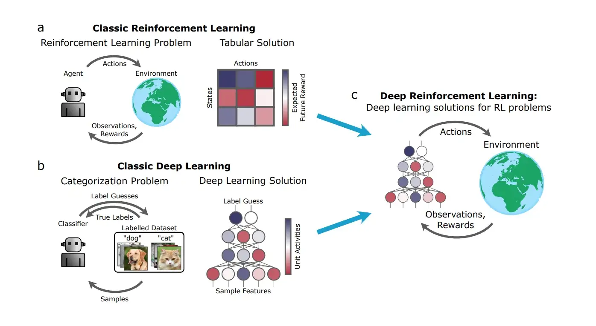

Artificial Intelligence has been evolving quite a lot in recent years, and there are a lot of breakthroughs that are happening since the inception of Deep learning, surplus of data and [enhanced hardware (GPU's / TPU's)](https://www.researchgate.net/publication/325023664_Performance_of_CPUsGPUs_for_Deep_Learning_workloads) & [acclerated programming](https://jax.readthedocs.io/en/latest/notebooks/quickstart.html).

Currently AI has achieved a significant amount of things such as [beating human in games](https://www.deepmind.com/research/highlighted-research/alphago), [human-level speech recognition](https://cdn.openai.com/papers/whisper.pdf) towards [optimizing compilers](https://ai.googleblog.com/2022/07/mlgo-machine-learning-framework-for.html), and [developing algorithms](https://www.nature.com/articles/s41586-022-05172-4).

Reinforcement Learning is one of the driving force that led to this innovations the past few years.

## Reinforcement Learning

> Reinforcement learning problems involve learning what to do—how to map situations to actions—so as to maximize a numerical reward signal. In
an essential way they are closed-loop problems because the learning system’s actions influence its later inputs. 
>
> [Richard S. Sutton and Andrew G. Barto](https://web.stanford.edu/class/psych209/Readings/SuttonBartoIPRLBook2ndEd.pdf)

When I think of Reinforcement learning, I think about a space video game where we have the controls for our space guns and we have to shoot asteriods in space with limited ammunation. 
If we try to destroy all asteroids in space our ammo will run out and we won't be able to shoot nearby asteriod and that will lead to untimely demise of our ship and same thing would happen if we save too much ammo by not shooting asteriod.
Since it is a simple game we can try multiple turns and learn an optimal way of saving ourselves from the asteroids.

We can apply A.I. (Reinforcement learning) to save ourselves from these attacks by training our model to learn the enough trail and error.
In Reinforcement Learning we have:

- **Agent** - Our Spaceship
- **Environment** - Space
- **State** - A part of environment seen by our spaceship
- **Action** - To shoot or not 
- **Reward** - Weather we are alive or not
- **Policy** - The continuous series of action till we end the game

[Reinforcement learning](https://optimization.cbe.cornell.edu/index.php?title=Main_Page)

Together these forms the basis for Reinforcement Learning.

- Reinforcement learning tries to learn a optimal policy through trail-and-error by maximizing rewards through actions in a particular environment.

In order to build an optimal policy, the agent faces the dilemma of exploring new states while maximizing its overall reward at the same time. This is called [Exploration vs Exploitation trade-off](https://sites.cs.ucsb.edu/~suri/ccs130a/MultiArmBandit.pdf). To balance both, the best overall strategy may involve short term sacrifices. Therefore, the agent should collect enough information to make the best overall decision in the future.

What I personally like about Reinforcement Learning is how it ties up mathematics and human nature.

We humans learn a lot through experimentation and challenges, and we use those experiences to better suit us to our environment.
We are constantly evolving and exploring our environment to overcome adversaries.

While I was learning how to solve these problems I came up with a lot of things in field of probabilities and decision making such as Markov chain, Dynamic Programming, Monte-Carlo techniques and so on. I was intrigued by the fact that how these functions help our model to form better decision over time. 

## Techniques Used in Reinforcment Learning 
### [Markov Chains](https://towardsdatascience.com/introduction-to-markov-chains-50da3645a50d) 
Markov chains are a fairly common, and relatively simple, way to statistically model random processes. It consists of a state of transistions which are determined by some probability distributions that satisfy the Markov Property.

It basically generates a probability distribution on the basis of data gathered and uses it for prediction.

### [Q-learning](https://en.wikipedia.org/wiki/Q-learning)
Q-learning is a off-policy, model free algorithm that updates [it's value at the end of each step instead of at the end of an episode](http://www.scholarpedia.org/article/Temporal_difference_learning#:~:text=Temporal%20difference%20(TD)%20learning%20is,to%20drive%20the%20learning%20process.).

> Q-Learning is the algorithm we use to train our Q-function, an action-value function that determines the value of being at a particular state and taking a specific action at that state.

- Q comes from “the Quality” (the value) of that action at that state.

Q learning is not applicable for huge data where an actor can perform multiple actions, this is because as the number of actions increases the space complexity of this algorithm increases polynomial times which makes our incapable to use.

## Recent Advancements 

### Deep Learning
Deep Learning is a subset of machine learning inspired by neuron's present in brain. It gained popularity around 2012 during [ImageNet Large Scale Visual Recognition Challenge (ILSVRC)](https://arxiv.org/pdf/1409.0575.pdf), The ILSVRC is an annual computer vision competition developed upon a subset of a publicly available computer vision dataset called ImageNet. As such, the tasks and even the challenge itself is often referred to as the ImageNet Competition.
The goal of the challenge was to both promote the development of better computer vision techniques and to benchmark the state of the art.

[AlexNet](https://papers.nips.cc/paper/2012/hash/c399862d3b9d6b76c8436e924a68c45b-Abstract.html) was developed using a deep convolutional neural network, which achieved excellent results in the classification of images. There has been a steady rise in the popularity of deep learning techniques since then.

Deep learning has made significant progress since then and is now used in a wide variety of applications, one the the key example lies with [AlphaFold](https://alphafold.ebi.ac.uk/) which was [the top-ranked protein structure prediction method by a large margin, producing predictions with high accuracy](https://predictioncenter.org/casp14/zscores_final.cgi) which will help us to find better solutions in finding.

### Accelerated Programming
There are many frameworks that evolved recently that uses parallel programming and efficient use of resources in order to [speed up the process](https://escholarship.org/uc/item/84w2k2xr). These frameworks helped a lot in Machine Learning research and allow us to access bigger, distributed data and train models on them.

## Deep-Q-Learning

> Deep Q-Learning uses a deep neural network to approximate the different Q-values for each possible action at a state.
>
>

Further Reading :
- [History of Reinforcement Learning](http://incompleteideas.net/book/ebook/node12.html)
- [lilianweng](https://lilianweng.github.io/posts/2018-02-19-rl-overview/#sarsa-on-policy-td-control)
- [Computer History Museum](https://computerhistory.org/blog/ai-and-play-part-2-go-and-deep-learning/)
- [Survey Paper](https://arxiv.org/pdf/cs/9605103.pdf)