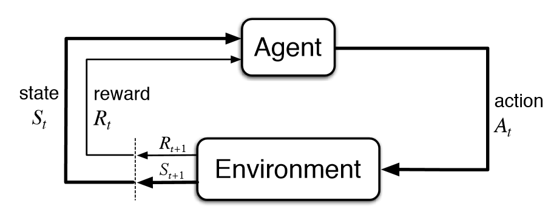
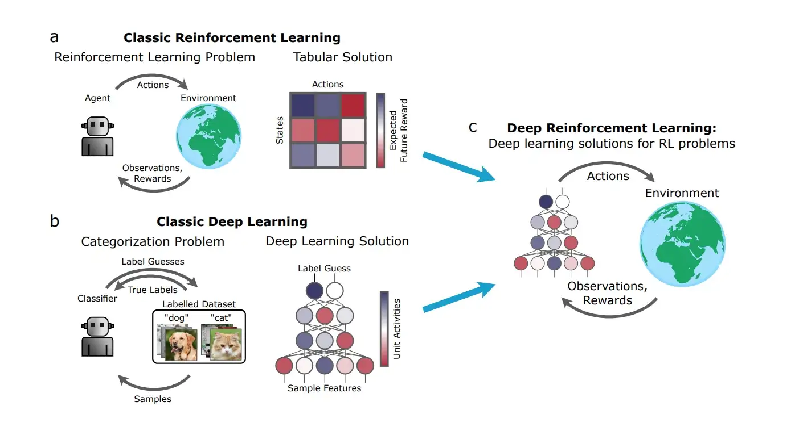

Artificial intelligence has evolved quickly over the last decade, driven by deep learning, large-scale data, and better hardware. Reinforcement learning is one of the fields that pushed many of those advances forward.

## Reinforcement Learning

> Reinforcement learning problems involve learning what to do so as to maximize a numerical reward signal.

When I think about reinforcement learning, I picture a simple space game where a ship has limited ammunition and has to survive an asteroid field. If it shoots everything too early, it runs out of ammo. If it saves too much, nearby asteroids destroy the ship. Over repeated attempts, it can learn a better strategy.

This gives us the standard ingredients:

- **Agent**: the spaceship
- **Environment**: space
- **State**: the part of the environment visible to the ship
- **Action**: whether to shoot or not
- **Reward**: whether the outcome improves survival
- **Policy**: the strategy followed over time

Reinforcement learning aims to learn a good policy through trial and error while maximizing reward.

One of the main challenges is the **exploration vs. exploitation** tradeoff. The agent needs to gather enough information about the world while still trying to earn reward efficiently. That usually means accepting short-term sacrifice for better long-term behavior.

What makes reinforcement learning interesting to me is how strongly it connects mathematics, uncertainty, and decision-making.

## Techniques Used in Reinforcement Learning

### Markov Chains

Markov chains are a common way to model random processes where future transitions depend on the current state. They provide a useful foundation for thinking about sequential decision systems.

### Q-Learning

Q-learning is an off-policy, model-free algorithm that updates an estimate of action values over time.

In plain terms, it learns how good a specific action is in a specific state.

One limitation is scale: when the state or action space becomes too large, tabular Q-learning becomes impractical.

## Recent Advancements

### Deep Learning

Deep learning dramatically expanded what reinforcement learning systems could represent and optimize. Neural networks made it possible to approximate value functions and policies in environments where hand-crafted tables were not enough.

### Accelerated Programming

Modern hardware and software stacks made it much easier to run large experiments. Efficient compute is one of the reasons RL research became more practical.

## Deep Q-Learning

Deep Q-learning uses a neural network to approximate Q-values for actions in a state.

## Further Reading

- [History of Reinforcement Learning](http://incompleteideas.net/book/ebook/node12.html)
- [Lilian Weng overview](https://lilianweng.github.io/posts/2018-02-19-rl-overview/#sarsa-on-policy-td-control)
- [Computer History Museum](https://computerhistory.org/blog/ai-and-play-part-2-go-and-deep-learning/)
- [Survey paper](https://arxiv.org/pdf/cs/9605103.pdf)
